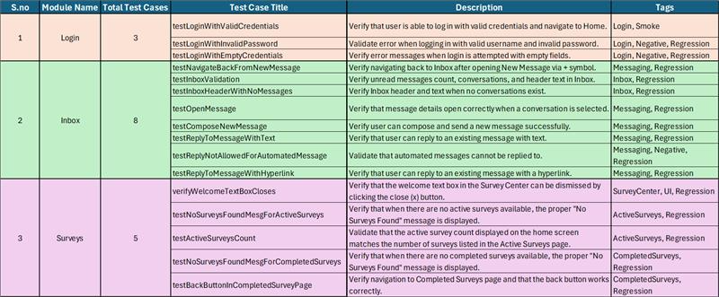

# 📱 Abacus Health POC  -  Mobile Automation Framework
> A POC project demonstrating mobile automation of GHG Healthy Weight application using Appium Java Framework with Page Object Model (POM) design pattern.


## 📌 Application Under Test

> We are using GHG Healthy Weight Mobile Application (Android).
Apk version used in this POC: GHG-HW_132(103).apk
 

## 📑 Scenarios



## 🛠 Tools Used :

* Appium
* Jdk(>=11)
* Selenium WebDriver 
* TestNG 
* Maven 
* Apache POI
* Extent Report

## ⚙️Installation

- Install the dependencies and tools required to run the tests:

- Install Appium and verify using appium-doctor

- Install Java JDK (>=11)

- Install Maven (>=3.5.1)

- Install Android SDK for mobile platform setup

- Clone this repository (or download as ZIP)

- Navigate to the project directory and build dependencies:
```bash
    mvn clean install
```
## ▶️ Run Application

### Running the tests on Real device :

> To run your tests on local simply you need to execute the xml file from the folder Resources/TestSuites/RealDevice.

### Running the tests on Lambda Test :

> Update "Lambda Test", "Cloud Execution" parameters value in config.properties and set as "True".
>To run your tests on Lambda Test simply you need to execute the xml file from folder resources/Testsuites/LambdaTest.


### Running the tests on browser stack :

> Update "browserstack" , "Cloud Execution" parameters value in config.properties and set as "True".
>To run your tests on browser stack simply you need to execute the xml file from folder resources/Testsuites/LambdaTest.

## 📊 Extent Test Report
>After test execution, open the HTML report in any browser for a detailed pass/fail log with screenshots, video recording. HTML Reports are available under:
>./Reports/MobileReports/CurrentDateStamp/CurrentGHG-Date&TimeStamp.html

## 📂 Data Driven Framework : 

> Used Apache POI to fetch the test data from excel file that is under resources > Files > TestData.xlsx

## 🎯 Locators :

> Added locators in android_Locators.json file under resources > Locators directory

## 📄🧩 Page Object Model : 

> Added pages under src/test/java/com/framework/goodhealthgateway/android/screens/healthyweight package
> 
> Added tests under src/test/java/com/framework/goodhealthgateway/android/testcases/healthyweight package
> 
> Added common classes and helper classes under src/test/java/com/framework/goodhealthgateway package
